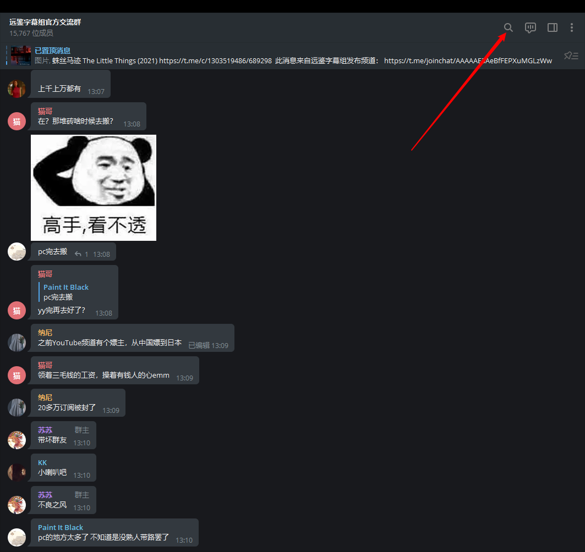
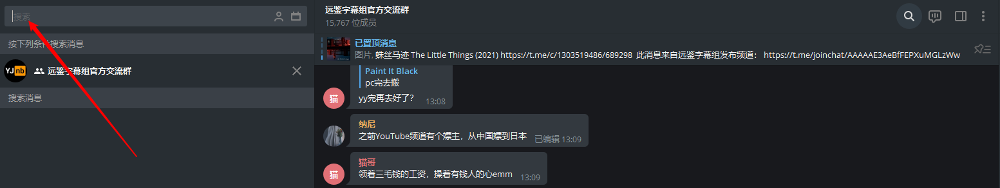
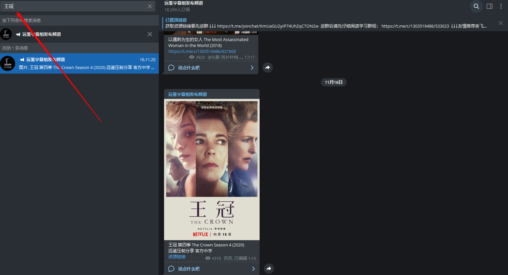

前言：          
(远鉴群内禁止求和发国产影视剧及国内流媒体有引进版权的影视剧，违者禁言7天)      
实在想看国内版权的可以去这里：        
[奈菲影视](https://nfmovies.com)               

# 如何搜索远鉴群或频道发过的资源                      
以下以PC端telegram作为演示平台，手机端类似，就不再赘述手机端了。                

第一步：打开远鉴群，点击群里右上角的搜索🔍按钮（如下图）          
                    

第二步：在弹出的新窗口中输入剧名并回车（鉴于当下telegram中文搜索的糟糕体验，请尽量精确输入，否则可能搜不到。还有，远鉴的资源名称一般与豆瓣译名保持一致，请不要使用港澳台及其他字幕组的译名来搜索，有可能搜不到。示例如下图）      
             

第三步：回车后所有从最近到以前包含你搜索的字眼的消息都会排列出来，你可以挨个点击跳转过去查看是不是你要的资源（如果失效了，可以群里艾特苏苏仙女给你补档）                    
     

其他：远鉴频道类似群组操作，不再赘述（演示如下图）         
    
       

